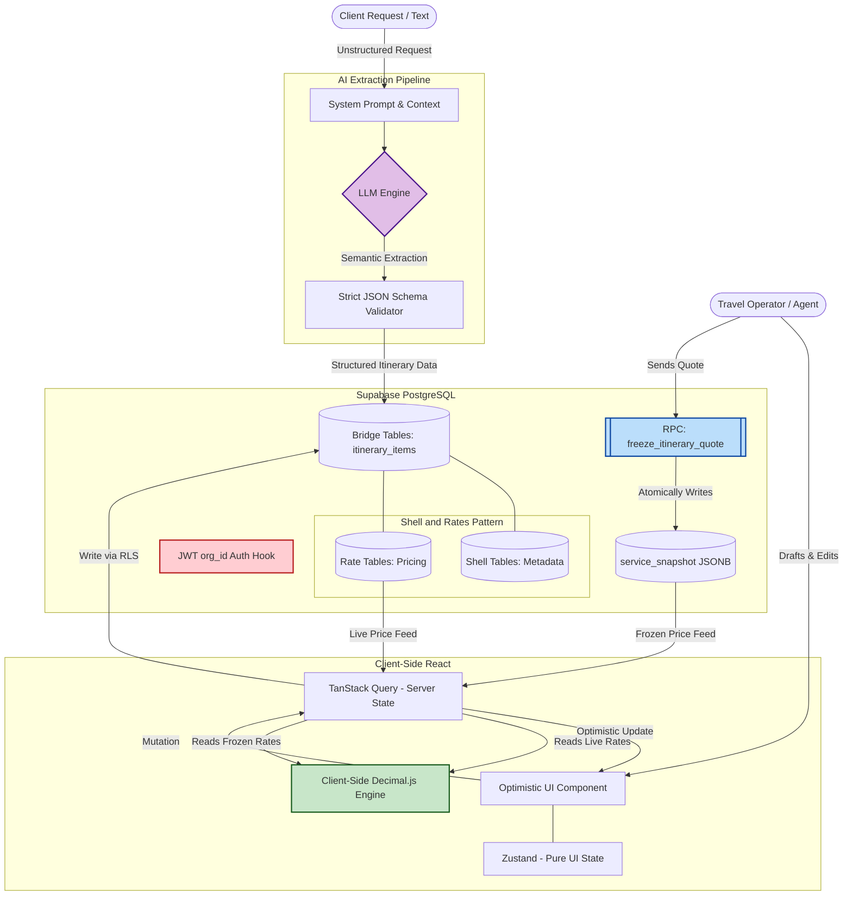

# Travel Suite Pro - Architecture & System Design

> **Note to Reviewers:** This repository serves as a public architectural showcase and technical portfolio. Due to commercial integrity, the proprietary frontend source code (React) and private infrastructure credentials are not included. This repository exposes the core system design, AI orchestration logic, and PostgreSQL database schema (with strict RLS and Tenant Isolation) powering the application.

## Overview: What is Travel Suite Pro?

Travel Suite Pro is a B2B Travel Management ERP built to solve the most expensive bottleneck in travel agencies: translating unstructured, chaotic client requests into strictly typed, financially accurate itineraries.

Instead of relying on manual data entry, the platform leverages an AI-driven semantic extraction pipeline to parse natural language constraints. The AI acts as a sophisticated ingestion engine, but the core value lies in the backend architecture: every AI output is forced through a deterministic `Shell+Rates` pricing model in PostgreSQL. 

This ensures that while the input is probabilistic (AI), the output is mathematically sound, tenant-isolated, and immutably snapshotted upon quote generation.

## System Demo

## Core Principles

### I. Shell+Rates Pattern

Every service type (activities, transports, accommodations, guides, other
services) MUST follow the Shell+Rates architectural pattern:

- **Shell tables** store metadata only: name, service type, location,
  description — never pricing.
- **Rate tables** store per-supplier pricing: base_cost, pricing_model
  (FIXED/PER_PAX/BASE_EXTRA), currency_code.
- **Bridge tables** link a Shell service instance to an Itinerary, recording
  which Rate was selected and freezing a `service_snapshot JSONB` at quote time.
- **Child tables** decompose bridge items into sub-components (rooms, segments,
  activity components).

Rationale: This separation prevents pricing changes from corrupting historical
quotes, enables multi-supplier sourcing per service, and keeps the catalog
schema uniform across all 5 service types.

### II. Multi-tenant by Organization

Every public table MUST include an `organization_id` column with a foreign key
to `organizations.id`. RLS policies enforce tenant isolation:

- **Fast path**: `auth.jwt() ->> 'org_id'` reads the claim injected by the
  `org_id_jwt_hook()` auth trigger at login. Zero JOINs against `profiles`.
- **Fallback**: `SELECT organization_id FROM profiles WHERE id = auth.uid()` for
  legacy users without the JWT claim.
- **Storage RLS**: `(string_to_array(name, '/'))[1] = auth.jwt() ->> 'org_id'` —
  tenant isolation via first path segment, no subquery.
- **SECURITY DEFINER RPCs** (`freeze_itinerary_quote`, `rpc_rebuild_snapshot`)
  verify `v_org_id = v_auth_org` explicitly before mutation.

Rationale: A single seq-scan on profiles per policy check caused severe latency
under concurrent load. JWT claims eliminate this entirely.

### III. Snapshot-based Pricing Freeze

Quoted prices MUST be frozen at the moment of status transition to `quote_sent`:

- The RPC `freeze_itinerary_quote(p_itinerary_id)` atomically writes
  `service_snapshot JSONB` on all 4 bridge tables + sets `quote_valid_until`
  (90 days) and `quote_sent_at`.
- No database triggers write `service_snapshot`. All prior trigger-based
  approaches (outbox, synchronous cascade, JSONB AFTER triggers) were removed
  due to deadlock risk.
- `rpc_rebuild_snapshot()` exists for manual draft refresh but MUST skip frozen
  itineraries (idempotent — returns existing snapshot).
- The client `QuotationView` reads `service_snapshot` first; only falls back to
  live catalog rates when snapshot is NULL.

Rationale: Pricing integrity for sent quotes is non-negotiable. Catalog prices
change; sent quotes must not.

### IV. Client-Side Financial Calculations

All financial calculations MUST occur in the browser using `decimal.js` with
precision 20 and `ROUND_HALF_UP` rounding:

- `calculateActivityGroupCost()` / `calculateTransportGroupCost()` /
  `calculateRoomGroupCost()` compute from live catalog rates.
- `calculateActivityGroupCostFromSnapshot()` / `calculateTransportCostFromSnapshot()` /
  `calculateRoomCostFromSnapshot()` compute from frozen snapshot JSONB.
- `compareWithSnapshot()` detects cost drift (`|snapshot - current| > 0.01`),
  name changes, and service deletions.
- There MUST be NO server-side "calculate total" endpoint. Totals are derived
  client-side from individual bridge item costs.

Rationale: Eliminates network round-trips for financial feedback during drafting
and avoids server-side floating-point drift. The snapshot comparison enables the
UI to flag "price changed since quote was sent" without reloading.

### V. Optimistic UI with TanStack Query

Server state MUST be managed exclusively via TanStack Query, with Zustand
reserved for pure UI state (sidebar, modals, view mode, drag active id):

- All mutations MUST follow the optimistic update pattern:
  `onMutate: cancelQueries → snapshot → setQueryData; onError: restore snapshot;
  onSettled: invalidateQueries`.
- Query keys MUST be triple-keyed as `['resource', id, orgId]` for cache
  isolation across tenants.
- The query function MUST be disabled when the required ID or orgId is falsy.
- No server data MAY be stored in Zustand or any other global state store.

Rationale: Optimistic UI provides instant feedback during drafting. Triple-keyed
queries prevent cross-tenant cache leaks. Zustand-only-for-UI prevents the
common mistake of duplicating server state.

## Security & Compliance

### RLS and JWT Hardening

- All tables with `organization_id` MUST have exactly two RLS policies:
  - `Tenant Isolation <table>` for `authenticated` role: `USING (organization_id =
    get_auth_org_id()) WITH CHECK (organization_id = get_auth_org_id())`.
  - `RLS_<TableName>` for general access: `USING (organization_id = get_org_id()
    AND deleted_at IS NULL)`.
- JWT `org_id` claim MUST be injected on every login via the
  `org_id_jwt_hook()` trigger (`BEFORE UPDATE OF last_sign_in_at`).
- SECURITY DEFINER functions MUST use `SET search_path = ''` and explicitly
  verify org ownership before mutation.

### Soft-Delete Discipline

- All Shell and Rate tables (14 tables total) MUST implement soft delete via
  `deleted_at TIMESTAMPTZ` + `BEFORE DELETE` trigger (`trg_soft_delete`).
- Bridge tables (`itinerary_*`, `stay_rooms`, components, segments) MUST NOT
  have soft delete — their deletion is intentional document editing.
- Snapshot builder functions MUST filter `AND deleted_at IS NULL` in JOINs so
  frozen quotes capture or exclude deleted rates correctly.

### Multi-Currency Integrity

- All rate tables MUST have `currency_code CHAR(3) DEFAULT 'USD'`.
- Itineraries MUST have `base_currency CHAR(3) DEFAULT 'USD'`.
- At freeze time, the exchange rate metadata (rate, from, to, frozen timestamp)
  MUST be injected into every `service_snapshot` via the `||` JSONB operator.

## Data & Persistence

### Migration Discipline

- All schema changes MUST be additive SQL migrations in `supabase/migrations/`
  with the format `YYYYMMDDHHMMSS_description.sql`.
- Migrations MUST be idempotent: use `IF NOT EXISTS`, `DROP ... IF EXISTS`,
  and `ADD COLUMN IF NOT EXISTS` liberally.
- Each migration MUST have a header comment explaining purpose, changes, and
  any rollback considerations.
- Point-in-time recoverability: the sequence of migrations MUST produce the
  exact current schema when applied to a fresh database.

### Storage Organization

- Documents bucket: fully private, tenant-isolated via path prefix + JWT RLS.
- Media bucket: public reads, tenant-isolated writes.
- Path structure: `{bucket}/{org_id}/{itinerary_id}/{filename}`.

## Governance

This constitution supersedes all ad-hoc development practices. Amendments
require:

1. A documented proposal (PR or RFC) explaining the change and its rationale.
2. Review and approval by the project maintenance team.
3. Propagation of the change to all dependent templates (plan, spec, tasks
   templates if they reference affected principles).
4. A MAJOR version bump if principles are removed or redefined; MINOR for
   new principles or materially expanded guidance; PATCH for clarifications.

Compliance is verified during spec-kit planning (`/speckit-plan`) and
convergence (`/speckit-converge`) phases. Complexity must be justified when
any implementation violates a core principle.

**Version**: 1.0.0 | **Ratified**: 2026-07-18 | **Last Amended**: 2026-07-18
